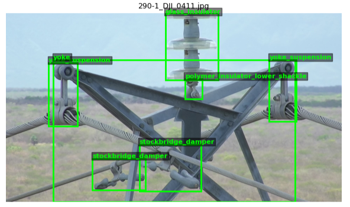
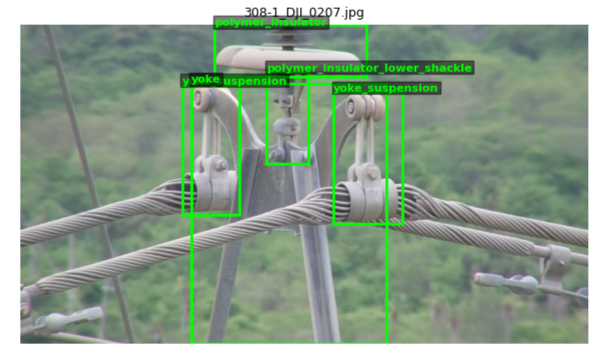
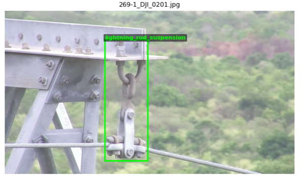
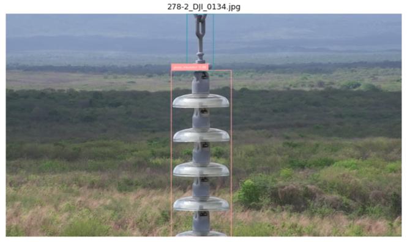
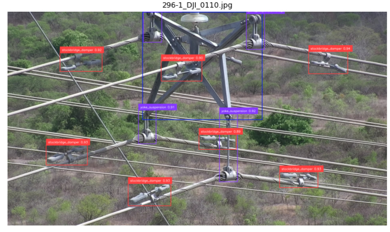
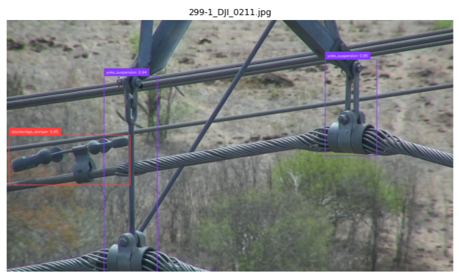

<div align="center">

# ⚡ InsPLAD Power Line Asset Inspection — RF-DETR

### Automated Defect-Relevant Component Detection for UAV-Based Transmission Line Inspection

[](https://python.org)
[](https://pytorch.org)
[](https://github.com/roboflow/rf-detr)
[](https://github.com/andreluizbvs/InsPLAD)
[](LICENSE)

</div>

---
---

## Demo

<p align="center">
  
  
  
</p>
<p align="center"><i>Raw UAV inspection imagery — input frames</i></p>

<p align="center">
  
  
  
  
</p>
<p align="center"><b><i>RF-DETR detections — powerline components localized and classified</i></b></p>

---
---

## 📋 Table of Contents

1. [Overview](#-overview)
2. [Why This Matters: The Case for Automated Line Inspection](#-why-this-matters-the-case-for-automated-line-inspection)
3. [Dataset](#-dataset)
4. [Architecture & Pipeline](#-architecture--pipeline)
5. [Repository Structure](#-repository-structure)
6. [Installation](#-installation)
7. [Dataset Preparation](#-dataset-preparation)
8. [Training](#-training)
9. [Results](#-results)
10. [Inference](#-inference)
11. [Limitations & Future Work](#-limitations--future-work)
12. [Citation](#-citation)

---

## 🎯 Overview

This project fine-tunes **RF-DETR** (Roboflow's real-time Detection Transformer) to detect and
classify **17 categories of power transmission line components** — insulators, dampers,
shackles, spacers, vari-grips, yokes, and tower ID plates — from high-resolution drone
(UAV) imagery, using the **InsPLAD-det** dataset.

The goal mirrors the work being done by companies like
**[DETECT Inspections](https://detectinspections.com/)**: replace manual, climb-based, or
binocular-based visual inspection of transmission towers with **drone footage + computer
vision**, automatically flagging and classifying every hardware component on a tower so
that human inspectors can focus their attention on what actually needs review.

**What the model does:** given a drone photo of a transmission tower, it draws a bounding
box around every recognisable hardware component and labels it with one of 17 fine-grained
classes — distinguishing, for example, a *glass insulator's tower shackle* from a *glass
insulator's big shackle*, or a *polymer insulator* from its *upper/lower/tower shackle*
attachments.

### The 17 Asset Classes

| Insulators & Strings | Shackles & Connectors | Dampers & Hardware |
|---|---|---|
| Glass Insulator | Glass Insulator – Big Shackle | Spiral Damper |
| Polymer Insulator | Glass Insulator – Small Shackle | Stockbridge Damper |
| | Glass Insulator – Tower Shackle | Spacer |
| **Towers & Markers** | Polymer Insulator – Lower Shackle | Vari-Grip |
| Tower ID Plate | Polymer Insulator – Upper Shackle | Yoke |
| | Polymer Insulator – Tower Shackle | Yoke Suspension |
| **Lightning Protection** | Lightning Rod Shackle | |
| Lightning Rod Suspension | | |

---

## 🌍 Why This Matters: The Case for Automated Line Inspection

Transmission and distribution towers carry every component in the table above — and **every
one of them is a potential failure point**. A cracked glass insulator, a corroded shackle, a
loosened spacer, or a missing damper can each independently lead to:

- **Conductor failure and unplanned outages** — a single failed insulator string can drop a
  transmission line, cutting power to entire regions.
- **Wildfire ignition** — failed hardware (especially dampers, spacers, and shackles) is a
  documented cause of arcing and sparking events that have started major wildfires near
  vegetation-dense rights-of-way.
- **Cascading grid failures** — transmission networks are interconnected; a single
  undetected fault can propagate into widespread blackouts.
- **Worker safety incidents** — undetected structural degradation increases risk during
  maintenance climbs.

### The Inspection Bottleneck

Utilities are required to inspect transmission corridors on a recurring cycle (often
annually), but traditional inspection methods don't scale:

- **Helicopter/binocular inspection** is expensive, weather-dependent, and relies on a
  human spotting small defects on components that may be 30+ metres away.
- **Manual photo review** — drones already capture thousands of images per flight, but
  having engineers manually review every photo for every one of dozens of component types
  is slow, expensive, and inconsistent between reviewers.
- **Component-level granularity is critical** — a generic "there's something here" detector
  isn't enough. Knowing *which* component (e.g. "polymer insulator tower shackle" vs.
  "polymer insulator lower shackle") tells the inspection team exactly what to look for and
  what failure mode to check.

### Where This Pipeline Fits

This RF-DETR model automates the **first and most time-consuming step**: scanning every
drone image, finding every relevant hardware component, and classifying it — turning an
unstructured folder of thousands of raw images into a structured inventory of
*"component X was seen at this location in this image, with this confidence."*

From there, this output directly feeds:

- **Automated triage** — route only images containing specific high-risk components
  (e.g. dampers, shackles) to human reviewers for defect assessment
- **Asset inventory & digital twins** — build a geo-referenced inventory of every
  insulator, damper, and shackle on a transmission corridor over time
- **Change detection** — compare component detections across inspection cycles to spot
  missing or newly-appeared hardware (a missing damper between flights is a maintenance
  flag)
- **Defect-detection pipelines** — once a component is localised, a second-stage
  classifier (defective / healthy) can run *only* on the cropped region — exactly the kind
  of two-stage pipeline production inspection systems like DETECT's are built around

> **In short:** this is the perception layer that makes large-scale, drone-based,
> AI-assisted transmission line inspection economically viable — turning a manual review
> bottleneck into an automated screening step.

---

## 📦 Dataset

[**InsPLAD-det**](https://github.com/andreluizbvs/InsPLAD) (Inspection of Power Line Assets
using Drones — detection subset) is a real-world dataset of high-resolution UAV photographs
of power transmission infrastructure, annotated with bounding boxes across **17 fine-grained
hardware component classes**.

Key characteristics that make this dataset valuable for production-style models:

- **Captured by real inspection drones** — images reflect actual field conditions: varying
  distances, angles, occlusion by conductors/towers, and natural lighting variation
  (bright sun, overcast skies, and shadowed components on the same tower)
- **Fine-grained class definitions** — many classes differ only by *which part of the
  insulator string* the shackle attaches to (tower / upper / lower), which is exactly the
  level of detail an inspection workflow needs
- **Severe class imbalance**, reflective of reality — towers have many insulators and
  dampers but comparatively few tower ID plates or lightning rod assemblies, mirroring the
  true distribution of hardware on a transmission line

### Dataset split used in this project

The raw dataset was converted to **COCO format** and split **70% / 15% / 15%** into
train / validation / test sets (see [`data_pipeline/convert_to_coco.py`](data_pipeline/convert_to_coco.py)).

---

## 🏗️ Architecture & Pipeline

```
┌─────────────────────────────────────────────────────────────────┐
│                     DATA PREPARATION                            │
│                                                                  │
│  InsPLAD-det raw (images + VOC/COCO/YOLO annotations)            │
│           │                                                      │
│           ▼                                                      │
│  convert_to_coco.py                                              │
│    • Auto-detects annotation format per image                   │
│    • Normalises 17 class names (handles naming variants)        │
│    • Splits 70/15/15 -> train / valid / test                     │
│    • Writes COCO _annotations.coco.json per split                │
└─────────────────────────────────────────────────────────────────┘
                        │
                        ▼
┌─────────────────────────────────────────────────────────────────┐
│                          TRAINING                                │
│                                                                  │
│  train_rfdetr.py                                                 │
│    • RF-DETR (base, ~29M params), COCO-pretrained                │
│    • Fine-tuned on 17 InsPLAD-det classes                        │
│    • AdamW, lr=1e-4, batch=8, grad_accum=2                       │
│    • Early stopping on validation mAP                            │
└─────────────────────────────────────────────────────────────────┘
                        │
                        ▼
┌─────────────────────────────────────────────────────────────────┐
│                     EVALUATION & INFERENCE                       │
│                                                                  │
│  evaluate.py        -> COCO mAP50 / mAP50-95 on held-out test set│
│  run_inference.py   -> Annotated images for any input drone photo│
└─────────────────────────────────────────────────────────────────┘
```

---

## 📁 Repository Structure

```
insplad-rfdetr-inspection/
│
├── README.md
├── requirements.txt
├── .gitignore
│
├── data_pipeline/
│   └── convert_to_coco.py      # Raw InsPLAD-det -> COCO format (train/valid/test)
│
├── train/
│   ├── train_rfdetr.py         # Fine-tune RF-DETR on the converted dataset
│   └── evaluate.py              # COCO-style mAP evaluation on a held-out split
│
├── inference/
│   └── run_inference.py        # Run the trained model on new drone images
│
└── assets/                      # Demo images for this README
    ├── raw_sample_*.jpg
    └── pred_sample_*.jpg
```

---

## ⚙️ Installation

### Prerequisites

- Python ≥ 3.10
- NVIDIA GPU with CUDA (training was run on a single GPU; inference also runs on CPU,
  just slower)

### Setup

```bash
git clone https://github.com/<your-username>/insplad-rfdetr-inspection.git
cd insplad-rfdetr-inspection

python -m venv .venv
source .venv/bin/activate        # Linux / macOS
# .venv\Scripts\activate         # Windows

pip install -r requirements.txt
```

---

## 📥 Dataset Preparation

### 1. Download InsPLAD-det

Get the dataset from the [official InsPLAD repository](https://github.com/andreluizbvs/InsPLAD)
(the README links to a Google Drive folder containing `InsPLAD-det.zip`). Extract it
locally, e.g. to `/data/InsPLAD-det-raw`.

### 2. Convert to COCO format

```bash
python data_pipeline/convert_to_coco.py \
    --raw_dir /data/InsPLAD-det-raw \
    --output_root /data/InsPLAD-det-coco \
    --train_split 0.70 \
    --val_split 0.15
```

This will:
- Auto-detect whether each image's annotation is Pascal VOC XML, COCO JSON, or YOLO `.txt`
- Normalise all class name variants to the canonical 17 InsPLAD-det classes
- Print a per-class instance count summary
- Write `train/`, `valid/`, and `test/` folders, each with images + `_annotations.coco.json`

> If the script reports "Unmapped class names", open `convert_to_coco.py` and add the
> printed raw label string to `CLASS_ALIASES`, then re-run.

---

## 🏋️ Training

```bash
python train/train_rfdetr.py \
    --dataset_dir /data/InsPLAD-det-coco \
    --output_dir runs/insplad_rfdetr \
    --model base \
    --epochs 25 \
    --batch_size 8 \
    --grad_accum_steps 2 \
    --lr 1e-4 \
    --resolution 560
```

### Training Configuration

| Parameter | Value | Notes |
|---|---|---|
| Model | RF-DETR (base, ~29M params) | COCO-pretrained backbone |
| Epochs | 25 | With early stopping (`patience=10`) |
| Batch size | 8 | Effective batch = 16 with `grad_accum_steps=2` |
| Optimizer | AdamW | `lr=1e-4` |
| Resolution | 560 | Must be divisible by 56 |
| Best checkpoint selection | EMA-weighted | `checkpoint_best_total.pth` |

> **GPU memory:** if you hit OOM, reduce `--batch_size` to 4 and double
> `--grad_accum_steps` to keep the effective batch size constant.
>
> **Higher accuracy:** pass `--model large` to use RF-DETR-Large (~128M params) if you have
> an A100-class GPU.

---

## 📊 Results

Trained for **25 epochs** with early stopping on validation mAP. Best checkpoint selected
via EMA weights (`regular mAP50-95 = 0.7765`, `EMA mAP50-95 = 0.7924`).

### Overall Validation Metrics

| mAP 50:95 | mAP 50 | mAP 75 | mAR @500 | F1 | Precision | Recall |
|:---:|:---:|:---:|:---:|:---:|:---:|:---:|
| **0.7691** | **0.9461** | **0.8180** | 0.8457 | **0.9137** | 0.9117 | 0.9171 |

At a glance: the model finds **94.6% of components at IoU≥0.5** (mAP50), with an overall
**precision/recall balance around 91%** — meaning roughly 9 in 10 detections are correct,
and roughly 9 in 10 actual components are found.

### Per-Class Validation Metrics

| Class | AP 50:95 | AR | F1 | Precision | Recall |
|---|:---:|:---:|:---:|:---:|:---:|
| spiral_damper | 0.8914 | 0.9362 | 0.9680 | 0.9510 | 0.9855 |
| stockbridge_damper | 0.8166 | 0.8601 | 0.9436 | 0.9344 | 0.9529 |
| glass_insulator | 0.9524 | 0.9763 | 0.9523 | 0.9249 | 0.9813 |
| glass_insulator_big_shackle | 0.6001 | 0.7862 | 0.8276 | 0.8276 | 0.8276 |
| glass_insulator_small_shackle | 0.6774 | 0.8281 | 0.8657 | 0.8286 | 0.9062 |
| glass_insulator_tower_shackle | 0.6195 | 0.7095 | 0.8500 | 0.8947 | 0.8095 |
| lightning_rod_shackle | 0.6211 | 0.7579 | 0.7887 | 0.8485 | 0.7368 |
| lightning_rod_suspension | 0.8588 | 0.8991 | 0.9826 | 0.9741 | 0.9912 |
| tower_id_plate | 0.9508 | 0.9575 | 0.9744 | 1.0000 | 0.9500 |
| polymer_insulator | 0.9479 | 0.9694 | 0.9582 | 0.9572 | 0.9592 |
| polymer_insulator_lower_shackle | 0.6637 | 0.7400 | 0.9022 | 0.8830 | 0.9222 |
| polymer_insulator_upper_shackle | 0.8481 | 0.8941 | 0.9743 | 0.9743 | 0.9743 |
| polymer_insulator_tower_shackle | 0.3771 | 0.5900 | 0.8000 | 0.8000 | 0.8000 |
| spacer | 0.6365 | 0.7421 | 0.8718 | 0.8500 | 0.8947 |
| vari_grip | 0.9020 | 0.9262 | 0.9760 | 0.9839 | 0.9683 |
| yoke | 0.8953 | 0.9484 | 0.9231 | 0.8966 | 0.9512 |
| yoke_suspension | 0.8153 | 0.8552 | 0.9750 | 0.9705 | 0.9795 |

### Reading the Per-Class Results

- **Strongest classes** (AP 50:95 > 0.90): `glass_insulator`, `tower_id_plate`,
  `polymer_insulator`, `vari_grip`. These are larger, visually distinctive components with
  abundant training examples — the model essentially nails these.
- **Hardest class**: `polymer_insulator_tower_shackle` (AP 50:95 = 0.377). This is the
  rarest and visually smallest shackle subtype, often partially occluded by the tower
  structure itself — a strong candidate for **targeted data augmentation or oversampling**
  in future training runs.
- **Shackle subclasses generally underperform insulators/dampers** (AP 50:95 in the
  0.60–0.68 range for big/small/tower shackle variants). These are small objects attached
  to larger ones, and distinguishing *which* shackle subtype it is from a distance is
  inherently harder than recognising "this is an insulator."
- **High recall across the board** (most classes > 0.85, several > 0.95) is particularly
  valuable for an inspection screening tool — **missing a component entirely is worse than
  a false positive**, since false positives just mean a human reviewer spends a few extra
  seconds confirming, while a false negative means a potentially-defective component never
  gets reviewed at all.

---

## 🔍 Inference

Run the trained model on new drone imagery:

```bash
python inference/run_inference.py \
    --weights runs/insplad_rfdetr/checkpoint_best_total.pth \
    --source /path/to/new_drone_images/ \
    --output_dir outputs/predictions \
    --threshold 0.4
```

Each output image is saved with bounding boxes and class labels overlaid (via
`supervision`'s `BoxAnnotator` / `LabelAnnotator`), ready to drop into a review dashboard or
this README's demo section.

---

## 🔮 Limitations & Future Work

- [ ] **Targeted oversampling for `polymer_insulator_tower_shackle`** and other shackle
      subclasses with AP 50:95 < 0.65 — the lowest-performing classes are also the rarest
- [ ] **Two-stage defect classification** — once a component is localised, train a
      lightweight classifier (healthy / corroded / cracked / missing) on the cropped region
- [ ] **Higher input resolution** (try `--resolution 728`) to better resolve small shackle
      components in high-resolution UAV photos
- [ ] **RF-DETR-Large** for a final accuracy push on an A100-class GPU
- [ ] **Geo-referenced output** — combine detections with drone GPS/telemetry metadata to
      build a per-tower component inventory across inspection cycles
- [ ] **Change detection across flights** — diff component detections between inspection
      cycles to flag missing/replaced hardware automatically
- [ ] **ONNX / edge export** — package the model for on-drone or edge-device inference to
      flag components for closer inspection during the flight itself

---

## 📝 Citation

If you use this work, please cite the InsPLAD dataset and RF-DETR:

```bibtex
@article{insplad2023,
  title   = {InsPLAD: A Dataset and Benchmark for Power Line Asset Inspection in UAV Images},
  author  = {Vieira-e-Silva, Andre Luiz Buarque and others},
  journal = {arXiv preprint},
  year    = {2023}
}

@article{rfdetr2025,
  title  = {RF-DETR},
  author = {Roboflow},
  year   = {2025},
  url    = {https://github.com/roboflow/rf-detr}
}
```

---

## 📄 License

This project is released under the [MIT License](LICENSE).

InsPLAD-det is subject to its own [terms of use](https://github.com/andreluizbvs/InsPLAD).
RF-DETR model weights are subject to [Roboflow's licensing terms](https://github.com/roboflow/rf-detr).

---

<div align="center">

**Built for safer, smarter, automated power line inspection** ⚡

*Inspired by the work of [DETECT Inspections](https://detectinspections.com/)*

</div>
